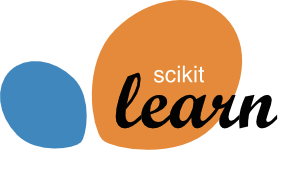

# 機械学習勉強会

## Introduction

[scikit-learn，Tutorials](http://scikit-learn.org/stable/tutorial/index.html)をベースに，機械学習の基礎を一通り学びます．

## Setup

[Python 3](https://www.python.org/)対応の[Anaconda](https://www.anaconda.com/download/)をインストールして頂ければ，問題ないと思います．Anacondaとは，Pythonのライブラリをまとめたディストリビューションです．以下が参考になります．

* [Qiita，Anaconda で Python 環境をインストールする](https://qiita.com/t2y/items/2a3eb58103e85d8064b6)

勉強会では，[Jupyter Notebook](http://jupyter.org/)を使います．Jupyter Notebookとは，ソースコードを含んだWebドキュメント作成を簡単に行える便利ツールです．使い方は以下をご参照ください．

* [Qiita，Jupyter事始め](https://qiita.com/taka4sato/items/2c3397ff34c440044978)
* [Qiita，はじめるJupyter Notebook](https://qiita.com/icoxfog417/items/175f69d06f4e590face9)

勉強会の教材は，[私のレポジトリ](https://github.com/haltaro/ml-tutorial)からダウンロードできます．

## Reference

本勉強会では，以下を参考にさせて頂きました．

* [Scikit-learn: Machine Learning in Python](http://jmlr.csail.mit.edu/papers/v12/pedregosa11a.html), Pedregosa *et al*., JMLR 12, pp. 2825-2830, 2011.
* [scikit-learn，Tutorials](http://scikit-learn.org/stable/tutorial/index.html)：Pythonの機械学習ライブラリであるscikit-learnのチュートリアルです．今回はテキスト処理は割愛します．
* [scikit-learn，Dimentionality reduction](http://scikit-learn.org/stable/modules/decomposition.html#decompositions)：Principal component analysis（PCA）を始めとする，次元削減技術のチュートリアルです．
* [scikit-learn， Preprocessing](http://scikit-learn.org/stable/modules/preprocessing.html#preprocessing)：正規化を始めとする，データの前処理のチュートリアルです．
* [久保拓哉，データ解析のための統計モデリング入門](http://amzn.asia/g3XaAKg)：データ解析の代表的な教科書です．Rのソースコードつき．
* [C. M. ビショップ，パターン認識と機械学習](http://amzn.asia/fK0o4k5)：機械学習の代表的な教科書です．特にSuport vector machineの解説で参考にさせて頂きました．

## Schedule

基本的に，毎週木曜に開催します．

|#|日付|テーマ|
|:--|:--|:--|
|1|10/26|[scikit-learn入門](https://github.com/haltaro/ml-tutorial/blob/master/01.intro_to_scikit-learn.ipynb)|
|2|11/2|[教師あり学習入門](https://github.com/haltaro/ml-tutorial/blob/master/02.intro_to_supervised.ipynb)（1/2）|
|3|11/9|[教師あり学習入門](https://github.com/haltaro/ml-tutorial/blob/master/02.intro_to_supervised.ipynb)（2/2）|
|4|11/21|[Support vector machine](https://github.com/haltaro/ml-tutorial/blob/master/03.svm.ipynb)|
|5|11/27|モデル選択|
|6|12/7|教師なし学習入門|
|7|12/14|主成分分析と因子分析|
|8|12/18|予備|

## Feedback

以下は，勉強会で頂いたフィードバックです．

- [x] モデル，予測器，分類器等の用語を整理すること（10/26）．
- [ ] ベクトルと行列の関係がわかりづらい．X，y，w等の関係を整理すること（11/10）．
- [ ] なぜL1正則化だとスパースなのか追記すること（11/10）．
- [ ] シグモイド関数を書き下すこと（11/10）．
- [ ] ロジスティック回帰で他クラス分類する方法を追記すること（11/10）．

## Tips

勉強会の主催を通して，以下のような知見を得られました．

- 全般
  - 勉強会は，何より自分の勉強になる．何となく理解していたことも，いざ人に説明しようとすると詰まることが多い．
  - Jupyter notebookは便利．参加者からの質問に対し，その場でコードを実行できるのは強い．
- Notebook
  - Notebookが長くなりすぎると，`import`等や変数名の依存関係が複雑になり扱いづらいため，できるだけ小分けにした方が良い．
  - セルが大きくなりすぎると，スクロールしづらくなる．本筋と関係ない関数等は，別モジュールでまとめて定義して`import`した方が親切．
  - 授業前に，Notebookは完結させておく．Notebookをローカルに保存して，独自にメモをとっている参加者もいるので，授業後の更新は極力控えたほうが親切．
  - 実行後に次のセルに進む`Shift+Enter`と，実行後も元のセルに留まる`Control+Enter`を使い分けると捗る．

## Acknowledgement

私の拙い説明に根気強く付き合い，いつも建設的なフィードバックをくれる勉強会メンバーに感謝致します．

## License
MIT License

Copyright (c) 2017 haltaro

Permission is hereby granted, free of charge, to any person obtaining a copy
of this software and associated documentation files (the "Software"), to deal
in the Software without restriction, including without limitation the rights
to use, copy, modify, merge, publish, distribute, sublicense, and/or sell
copies of the Software, and to permit persons to whom the Software is
furnished to do so, subject to the following conditions:

The above copyright notice and this permission notice shall be included in all
copies or substantial portions of the Software.

THE SOFTWARE IS PROVIDED "AS IS", WITHOUT WARRANTY OF ANY KIND, EXPRESS OR
IMPLIED, INCLUDING BUT NOT LIMITED TO THE WARRANTIES OF MERCHANTABILITY,
FITNESS FOR A PARTICULAR PURPOSE AND NONINFRINGEMENT. IN NO EVENT SHALL THE
AUTHORS OR COPYRIGHT HOLDERS BE LIABLE FOR ANY CLAIM, DAMAGES OR OTHER
LIABILITY, WHETHER IN AN ACTION OF CONTRACT, TORT OR OTHERWISE, ARISING FROM,
OUT OF OR IN CONNECTION WITH THE SOFTWARE OR THE USE OR OTHER DEALINGS IN THE
SOFTWARE.
